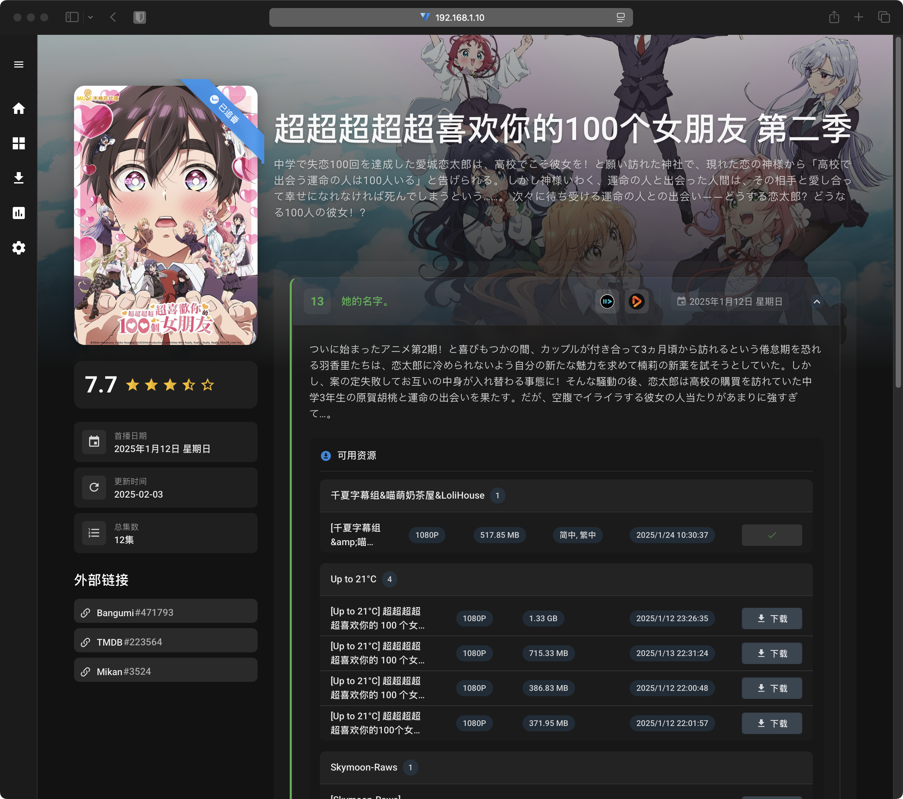
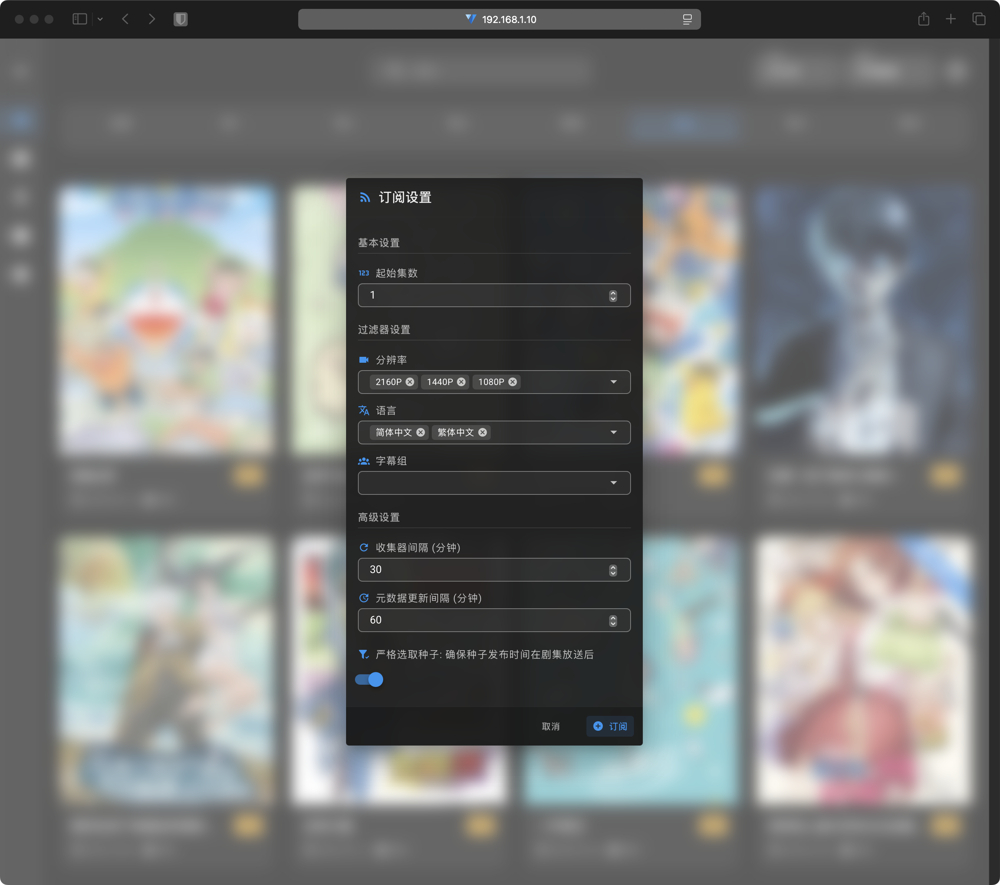
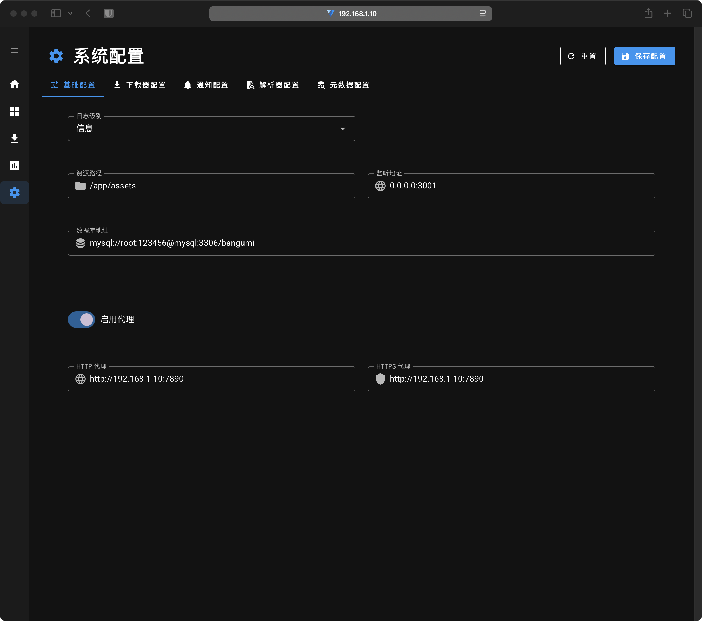
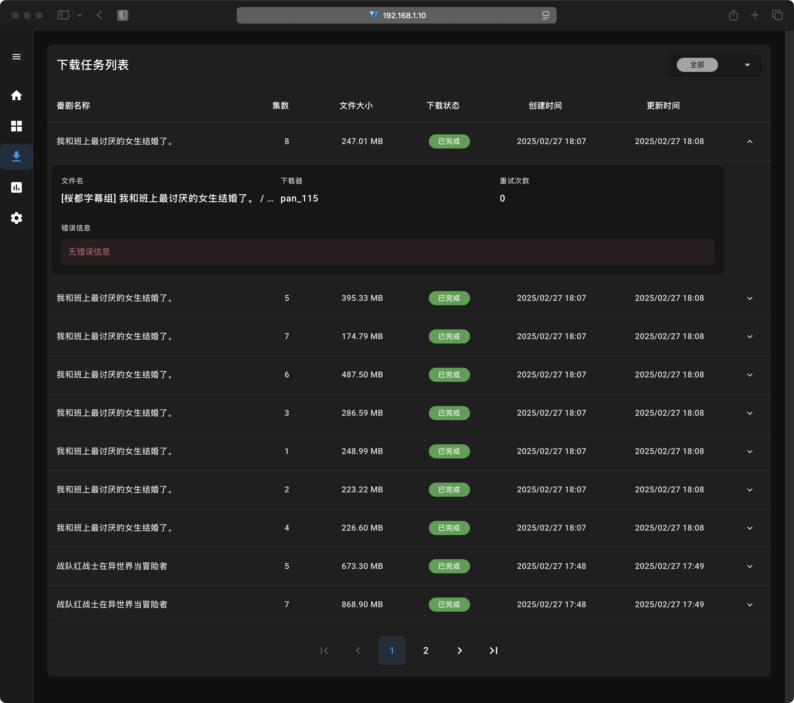

# 🌟 Bangumi-rs

    

 

 

<b>Bangumi-rs</b> 是一款动漫追番工具，支持订阅番剧、智能下载、在线播放等功能。 
采用 <b>Rust</b> 后端 + <b>Vue 3</b> 前端开发，高效稳定，界面美观。

 

<h2 align="center">✨ 功能特性</h2>

<table>
<tr>
<td width="50%">

  

    <h3>🎯 番剧订阅</h3>
    <ul>
      <li>✅ 支持订阅/取消订阅番剧</li>
      <li>✅ 可配置分辨率、字幕组、字幕语言过滤条件</li>
      <li>✅ 支持自定义订阅更新间隔</li>
    </ul>
  

  

    <h3>📥 智能下载</h3>
    <ul>
      <li>✅ 支持剧集偏移</li>
      <li>✅ 自动选择最佳种子</li>
      <li>✅ 支持用户手动选择要下载的剧集种子</li>
      <li>✅ 支持 115 网盘离线下载</li>
      <li>✅ 下载失败后会自动尝试其它种子</li>
    </ul>
  

  

    <h3>🌐 资源站点</h3>
    <ul>
      <li>✅ Mikan (<a href="https://mikanani.me/">https://mikanani.me/</a>)</li>
      <li>🔜 更多站点支持中...</li>
    </ul>
  

  

    <h3>🎬 在线播放</h3>
    <ul>
      <li>✅ 支持 IINA, Infuse 播放器在线播放</li>
    </ul>
  

  

    <h3>🔍 资源解析</h3>
    <ul>
      <li>✅ 采用传统方式解析文件名</li>
      <li>✅ 采用 ChatGPT 进行解析</li>
      <li>✅ 支持多个 API 服务提供商: SiliconFlow、OpenAI、DeepSeek</li>
    </ul>
  

  

    <h3>📚 元数据管理</h3>
    <ul>
      <li>✅ 自动获取番剧信息</li>
      <li>✅ 支持从多个数据源获取(TMDB、Bangumi.tv、Mikan)</li>
      <li>✅ 支持手动刷新元数据</li>
      <li>✅ 支持剧集、海报墙、封面等信息显示</li>
    </ul>
  

  <h3 align="center">🔔 通知提醒</h3>
  
✅ 支持 Telegram 通知

</table>

  <h2>🖼️ 精彩截图</h2>
  
优雅的界面设计，流畅的用户体验

<table>
<tr>
<td></td>
<td></td>
</tr>
<tr>
<td></td>
<td></td>
</tr>
</table>

 

  <h2>🤝 贡献</h2>
  
我们欢迎各种形式的贡献，一起让 Bangumi-rs 变得更好！

  
  
  
  

 

  <h2>📜 许可证</h2>
  
本项目采用 MIT 许可证

  
  

