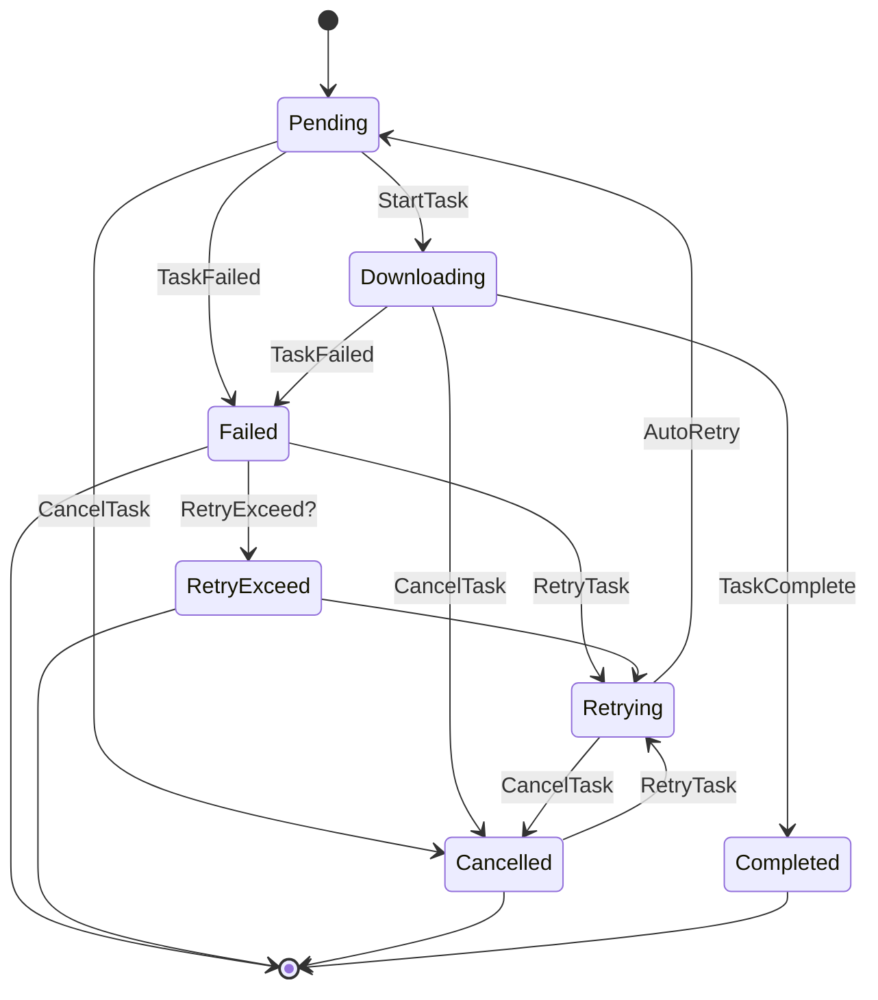

# 下载器状态流转图

```mermaid
stateDiagram
  direction TB

  
  [*] --> Pending
  Pending --> Downloading:StartTask
  Pending --> Cancelled:CancelTask
  Pending --> Failed:TaskFailed
  Downloading --> Completed:TaskComplete
  Downloading --> Failed:TaskFailed
  Downloading --> Cancelled:CancelTask

  Failed --> Retrying:RetryTask
  Failed --> [*]
  Failed --> RetryExceed: RetryExceed?
  state RetryExceed <<choice>>
  RetryExceed --> [*]
  RetryExceed --> Retrying

  Cancelled --> Retrying:RetryTask
  Cancelled --> [*]

  Retrying --> Pending:AutoRetry
  Retrying --> Cancelled:CancelTask
  Completed --> [*]
```