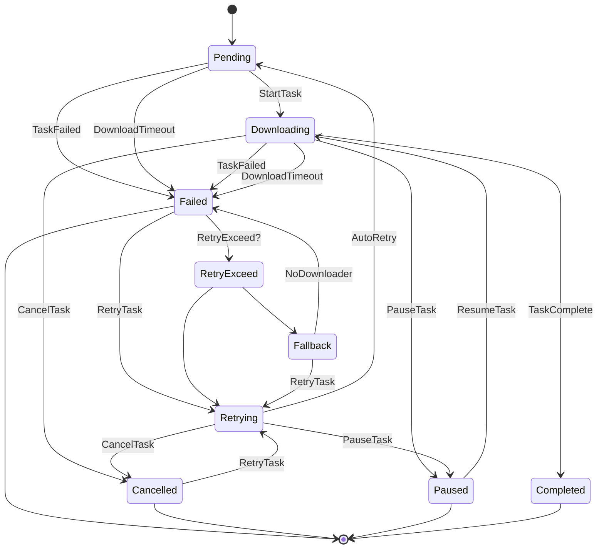

# 下载器状态流转图

```mermaid
stateDiagram
  direction TB


  [*] --> Pending
  Pending --> Downloading:StartTask
  Pending --> Failed:TaskFailed
  Pending --> Failed:DownloadTimeout
  Downloading --> Completed:TaskComplete
  Downloading --> Failed:TaskFailed
  Downloading --> Cancelled:CancelTask
  Downloading --> Failed:DownloadTimeout
  Downloading --> Paused:PauseTask

  Failed --> Retrying:RetryTask
  Failed --> [*]
  Failed --> RetryExceed: RetryExceed?
  state RetryExceed <<choice>>
  RetryExceed --> Fallback
  RetryExceed --> Retrying

  Cancelled --> Retrying:RetryTask
  Cancelled --> [*]

  Retrying --> Pending:AutoRetry
  Retrying --> Cancelled:CancelTask
  Retrying --> Paused:PauseTask

  Paused --> Downloading:ResumeTask
  Paused --> [*]

  Fallback --> Failed:NoDownloader
  Fallback --> Retrying:RetryTask

  Completed --> [*]
```

